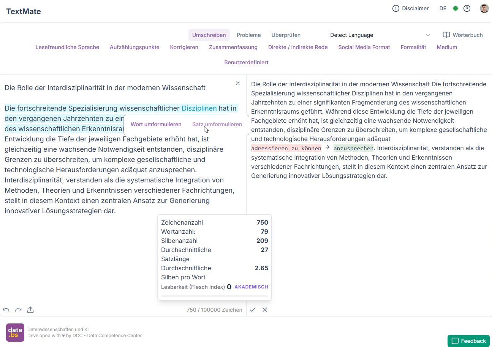

# TextMate (Frontend)



TextMate is a modern web application for advanced text editing, correction, and document validation. Built with Nuxt.js and TypeScript, it provides a rich set of tools to enhance writing experiences. This repository contains only the frontend code; the backend is written in Python FastAPI and available at [https://github.com/DCC-BS/text-mate-backend](https://github.com/DCC-BS/text-mate-backend).

 [](https://biomejs.dev)

---

<p align="center">
  <a href="https://dcc-bs.github.io/documentation/">DCC Documentation & Guidelines</a> | <a href="https://www.bs.ch/daten/databs/dcc">DCC Website</a>
</p>

---

## Features

### Core Capabilities

- **Grammar Correction**: Identifies and suggests fixes for grammar and spelling issues
- **Text Rewriting**: Offers alternative phrasings with customizable style, audience, and intent
- **Document Advisor**: Validates texts against selected reference documents with PDF preview
- **Word Synonyms**: Intelligent synonym suggestions based on context
- **Sentence Rewrite**: Context-aware sentence transformation
- **User Dictionary**: Personal dictionary for storing specialized vocabulary
- **Multilingual Support**: Available in English and German
- **MS Teams Integration**: Built-in support for Microsoft Teams platform

### Quick Actions

Eight specialized AI-powered text transformations:

- **Summarize**: Generate concise summaries of long texts
- **Bullet Points**: Convert paragraphs into structured bullet points
- **Formality**: Adjust text formality level (formal/informal)
- **Medium Length**: Optimize text for medium-length output
- **Social Media**: Optimize content for social media platforms
- **Character Speech**: Adapt text to character voice and speech patterns
- **Custom**: Flexible custom text transformations

## Technology Stack

- **Frontend**: [Nuxt.js](https://nuxt.com/) with TypeScript and Composition API
- **UI Framework**: [Nuxt UI](https://ui.nuxt.com/)
- **Text Editor**: [Tiptap](https://tiptap.dev/)
- **Package Manager**: [Bun](https://bun.sh/)
- **Internationalization**: Nuxt I18n
- **PDF Handling**: Vue PDF Embed

## DCC Documentation

For detailed documentation on the DCC project, please refer to the [DCC Documentation](https://dcc-bs.github.io/documentation/).

## Setup

### Environment Configuration

Create a `.env` file in the project root with the required environment variables:

```bash
APP_MODE=dev  # can be dev, build or prod see https://dcc-bs.github.io/documentation/dev-setup/varlock.html
AUTH_MODE=none  # none or azure
```

#### Optional Environment Variables

The following environment variables have defaults and can be overridden as needed:

| Variable | Description | Default | Type |
|----------|-------------|---------|------|
| **App Configuration** |
| `USE_FEEDBACK` | Enable feedback feature | `true` | boolean |
| `DUMMY` | Use dummy data (no backend requests) | `false` | string |
| **Build-time Variables** |
| `AUTH_LAYER_URI` | Auth layer Nuxt module | Auto from `AUTH_MODE` | URL |
| `LOGGER_LAYER_URI` | Logger layer Nuxt module | `github:DCC-BS/nuxt-layers/pino-logger` | URL |
| **Runtime Variables** |
| `API_PORT` | Backend API port | `8000` | port |
| `NUXT_API_URL` | Backend API URL | `http://localhost:8000` (dev) | URL (public) |
| `NUXT_FEEDBACK_GITHUB_TOKEN` | GitHub token for feedback | - | string (sensitive, required if `USE_FEEDBACK=true`) |
| `NUXT_PUBLIC_LOGGER_LOG_LEVEL` | Frontend log level | `debug` (dev), `info` (prod) | enum: trace, debug, info, warn, error, fatal |
| `LOG_LEVEL` | Server log level | `debug` | enum: debug, trace, info, warn, error, fatal |

> **Note:** Build-time variables (`AUTH_LAYER_URI`, `LOGGER_LAYER_URI`) are resolved during `nuxt build` and must be passed as build arguments in Docker.

#### Azure Environment Variables

When `AUTH_MODE=azure`, the following Azure AD variables are **required**:

| Variable | Description | Default | Type |
|----------|-------------|---------|------|
| `NUXT_AZURE_AUTH_SECRET` | Session encryption secret | - | string (sensitive, required) |
| `NUXT_AZURE_AUTH_CLIENT_ID` | Azure AD client ID | Proton Pass (dev) | UUID (public) |
| `NUXT_AZURE_AUTH_TENANT_ID` | Azure AD tenant ID | Proton Pass (dev) | UUID (public) |
| `NUXT_AZURE_AUTH_CLIENT_SECRET` | Azure AD client secret | Proton Pass (dev) | string (sensitive) |
| `NUXT_AZURE_AUTH_API_CLIENT_ID` | Azure AD API client ID | Proton Pass (dev) | UUID (public) |
| `NUXT_AZURE_AUTH_ORIGIN` | Auth origin URL | `http://localhost:3000/api/auth` (dev) | URL (public) |

> **Note:** Generate the `NUXT_AZURE_AUTH_SECRET` with: `openssl rand -base64 32`

### Varlock & Secrets Management

We use [varlock](https://varlock.dev/) for environment variable validation and default value management. Varlock integrates with the Docker build process and can optionally fetch secrets from Proton Pass during development.

To validate and load environment variables:

```bash
varlock load
```

#### Proton Pass Integration (Optional)

For automatic secret retrieval from Proton Pass, ensure you have:
1. Install [pass-cli](https://github.com/DCC-BS/pass-cli)
2. Authenticate with Proton Pass: `pass-cli login`
3. Validate environment: `varlock load`

> **Note:** Proton Pass integration is optional. If you prefer to set environment variables manually, you can skip the Proton Pass setup and provide values directly in your `.env` file or environment. Varlock will use the manually provided values instead of fetching from Proton Pass.

In production (Docker), varlock runs as the container entrypoint, loading secrets at runtime.

### Install Dependencies

Make sure to install dependencies using Bun:

```bash
bun install
```

## Development

Start the development server on `http://localhost:3000`:

```bash
bun run dev
```

For debugging with inspector:

```bash
bun run debug
```

### Dummy Mode

For development without a backend connection, use dummy mode which returns mock data instead of calling the backend API:

```bash
bun run dummy
```

This allows frontend development without running the Python backend services.

### Backend Services

This frontend requires the [Text-mate backend](https://github.com/DCC-BS/text-mate-backend) service. The backend and all related services (LLM, LanguageTool) are configured in the `docker/` folder.

#### Development Mode (Backend Only)

Start only the backend services for development:

```bash
bun run docker:up
```

Stop backend services:

```bash
bun run docker:down
```

#### Full Stack with Nginx

To run all services including the frontend behind an nginx reverse proxy:

```bash
cd docker
varlock run -- docker compose up
```

This starts:
- **Frontend** (Nuxt.js app)
- **Backend** (Python FastAPI)
- **LLM Service** (vLLM with Qwen model)
- **LanguageTool** (Grammar checking)
- **Nginx** (Reverse proxy)

> **Note:** Ensure you have varlock configured with Proton Pass for environment variable management.

## Project Architecture

```
app/
├── components/       # Vue components (PascalCase)
│   ├── text-editor/         # Text editor components
│   └── tool-panel/          # Tool panel components
├── composables/        # Vue composition functions (useXxx)
├── utils/               # Utility functions
├── assets/
│   ├── models/             # TypeScript models
│   ├── services/           # API services
│   └── queries/            # API queries
shared/
└── types/               # Shared TypeScript types
server/
├── api/                # API endpoints (kebab-case)
└── plugins/            # Server plugins
tests/
├── assets/             # Unit tests (*.test.ts)
└── e2e/               # E2E tests (*.spec.ts)
```

## Testing & Linting

Run tests with Vitest:

```bash
# Run tests
bun test

# Run tests in watch mode
bun test:watch

# Generate coverage report
bun test:coverage
```

Format code with Biome:

```bash
bun run lint
```

Check and fix code issues:

```bash
bun run check
```

### E2E Testing

End-to-end tests cover key features:
- Undo/Redo operations
- Text statistics
- Text rewriting
- Problem detection
- Quick actions

## Production

Build the application for production:

```bash
bun run build
```

Generate static site:

```bash
bun run generate
```

Preview production build:

```bash
bun run preview
```

## Docker Deployment

The application includes a multi-stage Dockerfile for production deployment.

### Docker Build Arguments

The Dockerfile accepts the following build-time arguments to configure Nuxt layers:

| Argument | Default | Description |
|----------|---------|-------------|
| `AUTH_LAYER_URI` | `github:DCC-BS/nuxt-layers/azure-auth` | Authentication layer implementation. Use `github:DCC-BS/nuxt-layers/no-auth` for development without Azure AD. |
| `LOGGER_LAYER_URI` | `github:DCC-BS/nuxt-layers/pino-logger` | Logging layer implementation. |

These are resolved during `nuxt build` and must be passed as build arguments:

```bash
# Build with default auth (Azure AD)
docker build -t text-mate-frontend .

# Build with no-auth for development
docker build --build-arg AUTH_LAYER_URI=github:DCC-BS/nuxt-layers/no-auth -t text-mate-frontend .

# Run the container
docker run -p 3000:3000 text-mate-frontend
```

For more details, see the [Auth Layer](https://dcc-bs.github.io/documentation/nuxt-layers/auth.html) and [Logger Layer](https://dcc-bs.github.io/documentation/nuxt-layers/logger.html) documentation.

## License

[MIT](LICENSE) © Data Competence Center Basel-Stadt

<a href="https://www.bs.ch/schwerpunkte/daten/databs/schwerpunkte/datenwissenschaften-und-ki"></a>

Datenwissenschaften und KI <br>
Developed with ❤️ by DCC - Data Competence Center
