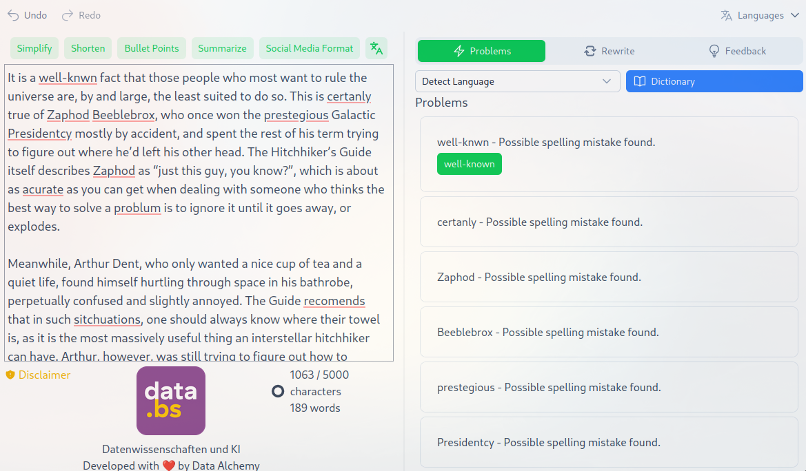

# TextMate (Frontend)



TextMate is a modern web application for advanced text editing, correction, and document validation. Built with Nuxt.js and TypeScript, it provides a rich set of tools to enhance writing experiences. This repository contains only the frontend code; the backend is written in Python FastAPI and available at [https://github.com/DCC-BS/text-mate-backend](https://github.com/DCC-BS/text-mate-backend).

 [](https://biomejs.dev)

---

<p align="center">
  <a href="https://dcc-bs.github.io/documentation/">DCC Documentation & Guidelines</a> | <a href="https://www.bs.ch/daten/databs/dcc">DCC Website</a>
</p>

---

## Features

- **Grammar Correction**: Identifies and suggests fixes for grammar and spelling issues
- **Text Rewriting**: Offers alternative phrasings with customizable style, audience, and intent
- **Document Advisor**: Validates texts against selected reference documents with PDF preview
- **Quick Actions**: Various text transformation tools including summarization and format conversion
- **User Dictionary**: Personal dictionary for storing specialized vocabulary
- **Multilingual Support**: Available in English and German

## Technology Stack

- **Frontend**: [Nuxt.js](https://nuxt.com/) with TypeScript and Composition API
- **UI Framework**: [Nuxt UI](https://ui.nuxt.com/)
- **Text Editor**: [Tiptap](https://tiptap.dev/)
- **Package Manager**: [Bun](https://bun.sh/)
- **Internationalization**: Nuxt I18n
- **PDF Handling**: Vue PDF Embed

## DCC Documentation
For detailed documentation on the DCC project, please refer to the [DCC Documentation](https://dcc-bs.github.io/documentation/).

## Setup

### Environment Configuration

Create a `.env` file in the project root with the required environment variables:

```
API_PORT=8000
API_URL=http://localhost:${API_PORT}

FEEDBACK_GITHUB_TOKEN=TODO

# azure auth
AUTH_LAYER_URI="github:DCC-BS/nuxt-layers/azure-auth" # for no auth use github:DCC-BS/nuxt-layers/no-auth
AUTH_ORIGIN=http://localhost:3000/api/auth
NUXT_AUTH_SECRET="" # Generate one: openssl rand -base64 32
AZURE_AD_CLIENT_ID="TODD"
AZURE_AD_TENANT_ID="TODO"
AZURE_AD_CLIENT_SECRET="TODO"
AZURE_AD_API_CLIENT_ID="TODO"

LOGGER_LAYER_URI="github:DCC-BS/nuxt-layers/pino-logger"
LOG_LEVEL=debug
```

### Install Dependencies

Make sure to install dependencies using Bun:

```bash
bun install
```

## Development

Start the development server on `http://localhost:3000`:

```bash
bun run dev
```

For debugging with inspector:

```bash
bun run debug
```

### Backend Setup

Create a `.env.backend` file in the `docker/` directory with the required environment variables:

```
LLM_API_PORT=8001

CLIENT_PORT=3000
CLIENT_URL=http://localhost:${CLIENT_PORT}
OPENAI_API_BASE_URL=http://vllm_qwen25_32b:${LLM_API_PORT}/v1
OPENAI_API_KEY=none
LLM_MODEL=Qwen/Qwen2.5-32B-Instruct-GPTQ-Int4

LANGUAGE_TOOL_PORT=8010
LANGUAGE_TOOL_API_URL=http://languagetool:${LANGUAGE_TOOL_PORT}/v2
LANGUAGE_TOOL_CACHE_DIR=~/.cache/languagetool

HF_AUTH_TOKEN=your_hugging_face_token
HUGGING_FACE_CACHE_DIR=~/.cache/huggingface
```

> **Note:** The `HF_AUTH_TOKEN` is required for Hugging Face API access. You can create a token [here](https://huggingface.co/settings/tokens).

#### Docker Management

The project includes configurable scripts for managing Docker containers with flexible environment variable loading:

```bash
# Start backend containers
bun run docker:up

# Stop backend containers
bun run docker:down
```

#### Custom Environment Loading

The Docker scripts support customizable environment variable loading methods:

- **Default**: Uses `source` to load `.env` and `docker/.env.backend` files
- **Custom**: Configure alternative methods (e.g., dotenvx, pass-cli) for encrypted secrets

To customize the environment loading:

1. Copy the example configuration:
   ```bash
   cp scripts/docker/docker.config.sh.example scripts/docker/docker.config.sh
   ```

2. Edit `scripts/docker/docker.config.sh` to define your `load_env()` function:
   ```bash
   function envx() {
       pass-cli run --env-file .env.keys -- dotenvx "$@"
   }

   function load_env() {
       # Example with dotenvx for encrypted .env files
       envx run -f .env docker/.env.backend -- "$@"
   }
    ```

The `scripts/docker/docker.config.sh` file is gitignored, allowing team members to use their own configuration while sharing a working default setup.

See [scripts/docker/README.md](scripts/docker/README.md) for detailed documentation.

## Testing & Linting

Run tests with Vitest:

```bash
# Run tests
bun test

# Run tests in watch mode
bun test:watch

# Generate coverage report
bun test:coverage
```

Format code with Biome:

```bash
bun run lint
```

Check and fix code issues:

```bash
bun run check
```

## Production

Build the application for production:

```bash
bun run build
```

Generate static site:

```bash
bun run generate
```

Preview production build:

```bash
bun run preview
```

## Docker Deployment

The application includes a multi-stage Dockerfile for production deployment:

```bash
# Build the Docker image
docker build -t text-mate-frontend .

# Run the container
docker run -p 3000:3000 text-mate-frontend
```

## License

[MIT](LICENSE) © Data Competence Center Basel-Stadt

<a href="https://www.bs.ch/schwerpunkte/daten/databs/schwerpunkte/datenwissenschaften-und-ki"></a>

Datenwissenschaften und KI <br>
Developed with ❤️ by DCC - Data Competence Center
